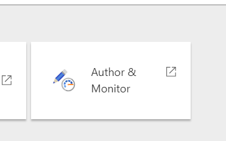
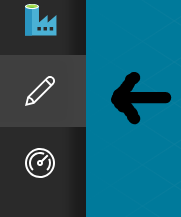
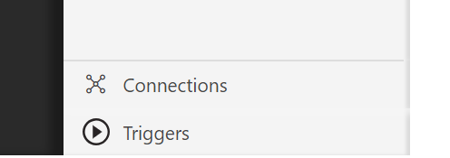
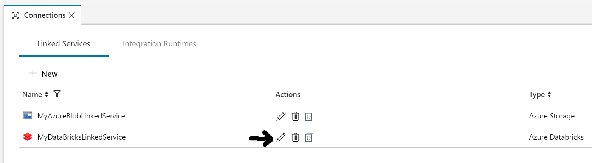
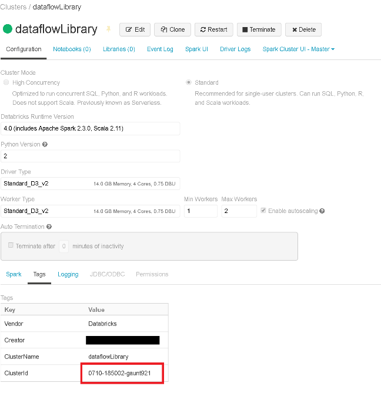

by balakreshnan <https://github.com/balakreshnan>

Here’s how to get started using Azure Data factory Data Flow
============================================================

This guide is for private preview customers to get started with Azure data factory v2 with data flow
----------------------------------------------------------------------------------------------------

1. To build your first Data Flow Data Factory, use the Azure Portal to create "Azure Data Factory" and select "V2 with data flow (preview)"

2. That will create your new Data Factory with Data Flows in the SE Asia region

3. Click on author & Monitor

    

That should take you to a new window which is azure data factory author main page

4. On the main page click on the left hand side menu there should be pencil

    

5. Click on Connections in the left bottom of the page to edit the Azure Databricks Linked Service

    

6. Click on the Edit button as highlighted with black arrow

    

7. Now here you need to change the Azure databricks cluster to existing if you
    want to use existing running clusters

    

8. You will need to provide the access token key for your Azure Databricks account. [Here is more information on how to obtain that.](https://docs.databricks.com/api/latest/authentication.html#generate-token)

9. Make sure Select Existing Cluster

10. Then Get the cluster ID from the Azure Data bricks URL

11. Would be numbers and letters combined. If you go to azure Databricks
    workbench and select the cluster, you will see the Cluster ID in the Tags
    section at the bottom of the cluster page:

    

12. Copy and paste that in the configuration page.

You're done! Now the Data factory is ready for submitting the jobs with data transformaions via Data Flow.
