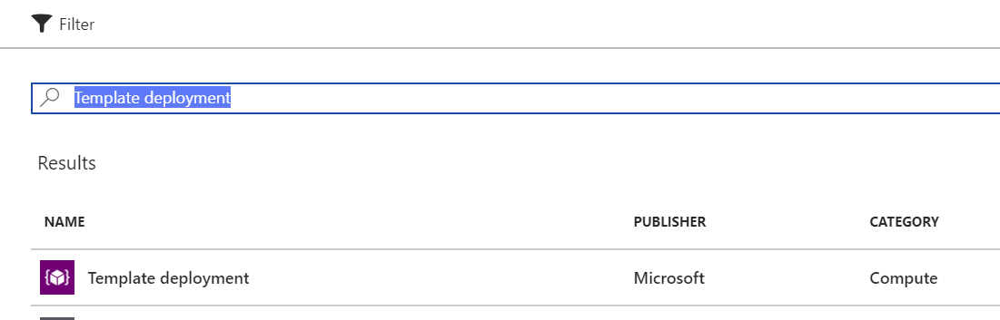
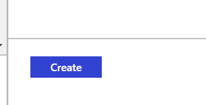
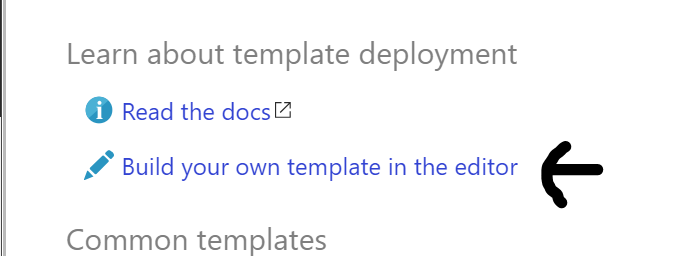
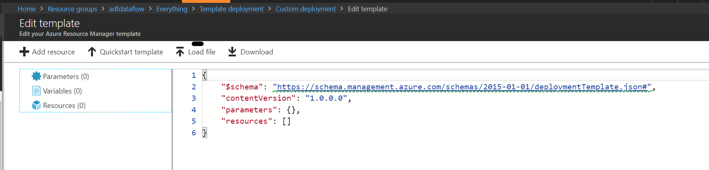
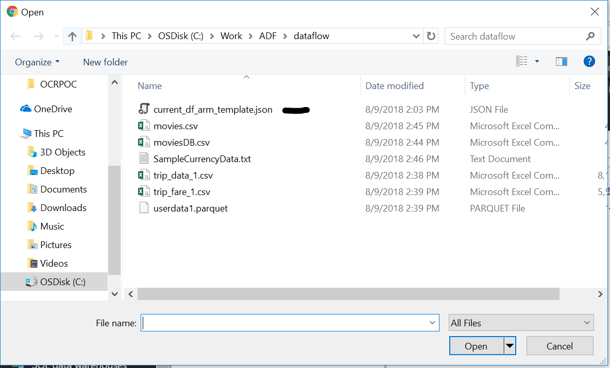
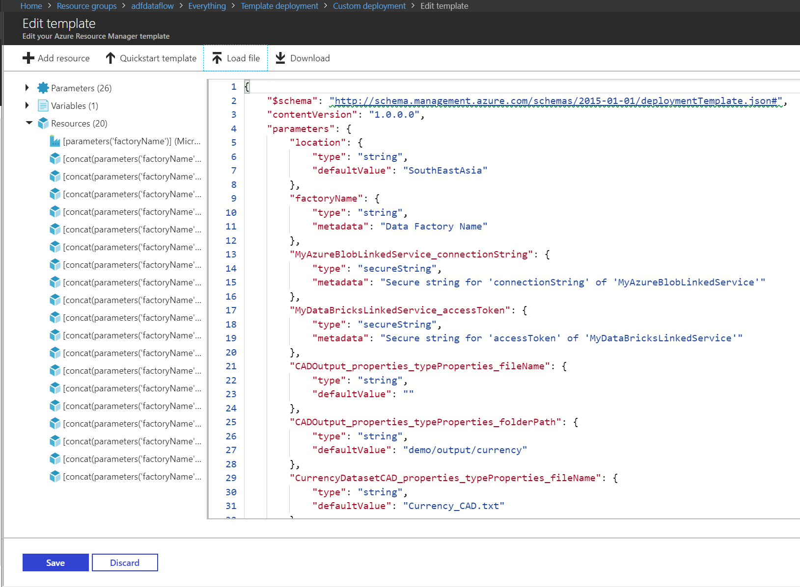
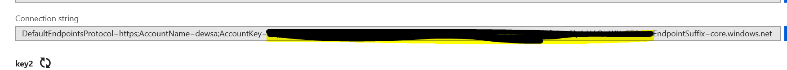
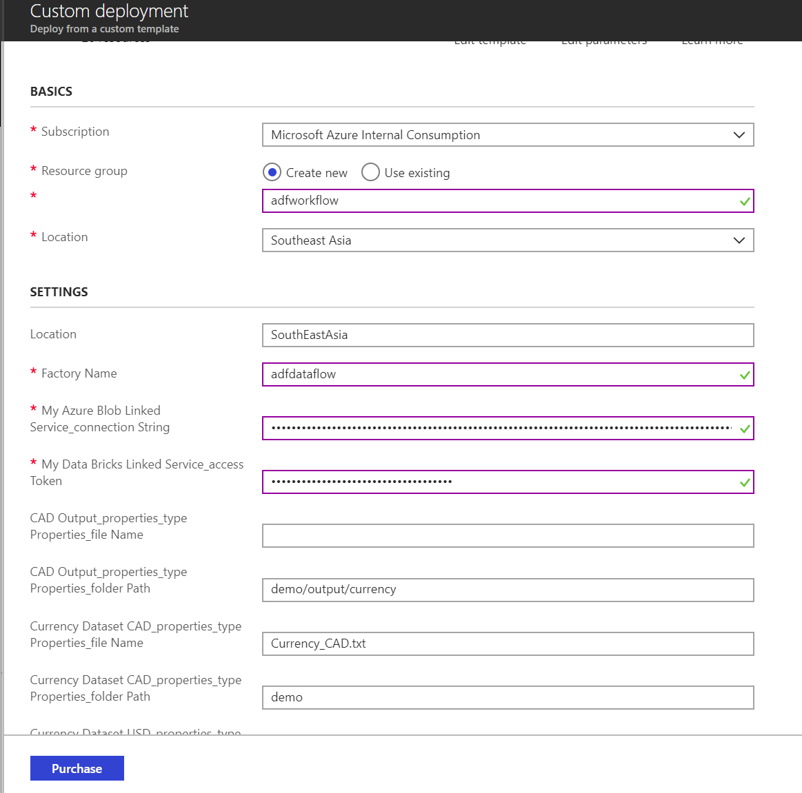
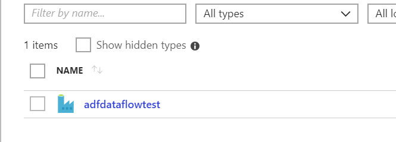
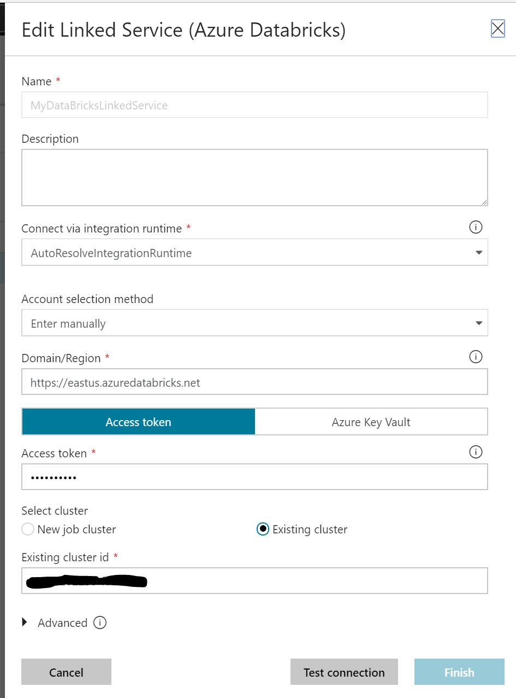

by @balakreshnan

Here’s how to get started using Azure Data factory Data Flow
============================================================

This guide is for private preview customers to get started with Azure data factory v2 with data flow
----------------------------------------------------------------------------------------------------

1.  Submit your subscription ID for whitelisting

2.  Go to: <https://github.com/kromerm/adfdataflowdocs/tree/master/samples>

3.  Download the file: “current_df_arm_template.json” and save it in local drive

4.  Now to go to Azure portal and then click new and search “Template
    deployment”

5.  Then select Template Deployment

1.  Click on Template deployment

2.  Then Select create on the page

    

3.  Then Click on Build your own template in the editor

    

4.  Now you should see a screen where you can upload the JSON file

5.  Now Click on Load File

    

6.  Open current_df_arm_template.json

    

7.  Now you should see the content of the file in the right side window

1.  Now Click Save

2.  Type in a New resource group name “adfdataflow”

3.  Select the region as southeast asia

4.  Now fill the Datafactory Name with the name you wish call your data flow

5.  Now go to the blob account and get the storage connection string

    

6.  Now go to Azure data bricks workspace.

7.  Go to clusters and then go to User Settings on the right top corner

    

8.  Now click User Settings and then click Generate New Token. Make sure to save
    the key because if you didn’t then you have to create a new key again

9.  Now you can paste the Token in the Azure portal

    

10. In the above picture you should be able to see the Blob connection string
    and also the Databricks linked services access

11. Then click on the Purchase button and sit and wait for few minutes to deploy

12. Once deployed go the resource group that you specified and then click on the
    azure data factory

    

13. Now you should see the Data factory Pane and click on author

14. Click on author & Monitor

    

15. That should take you to a new window which is azure data factory author main
    page

16. On the main page click on the left hand side menu there should be pencil

    

17. That should open the authoring canvas

18. Click on Connections in the left bottom of the page

    

19. Edit the Azure databricks Linked service

20. Click on the Edit button as highlighted with black arrow

    

21. Now here you need to change the Azure databricks cluster to existing if you
    want to use existing running clusters

    

22. Make sure Select Existing Cluster

23. Then Get the cluster ID from the Azure Data bricks URL

24. Would be numbers and letters combined. If you go to azure Databricks
    workbench and select the cluster, you will see the Cluster ID in the Tags
    section at the bottom of the cluster page:

    

25. Now copy that and paste that in the configuration page and then click on
    Test Connection

26. Then Click Finish

27. And now the Data factory is ready for submitting the jobs.
