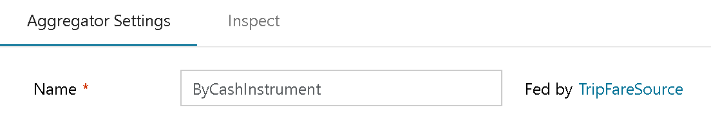

On each Transformation, with the exception of the Source & Union Transforms, you will see an "Incoming Steam" field on the tranformation's settings pane.

This tells you which incoming data streaming is feeding that transformation. You can change the physical location of your transform node on the graph by clicking the Incoming Stream name and selecting another data stream. The current transformation along with all subsequent transforms on that stream will then move to the new location.

If you are moving a transformation with 1 or more transformations after it, then the new location in the data flow will be joined via a new branch.

If you have no subsequent transformations after the node you've selected, then only that transform will move to the new location.
