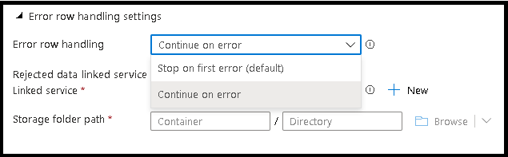
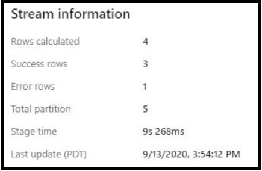

# Enable error row handling on Azure SQL DB sink types

Add this string to the end of your ADF URL: ```&feature.errorrowhandling=true```

# Sink settings

In the sink settings for an Azure SQL DB sink type, the default behavior is to fail on first error. You can modify this behavior by switching to "Continue on error" and setting the location where ADF will store the logs of the errored row details.



# Data flow monitoring output



When viewing the output of your data flow execution in the ADF monitoring view, the count of the rows that were successfully and those that failed will be shown from the sink output panel.

To view the rejected row details, use the Azure Storage Explorer to navigate to the folder container where you chose to store the log files.
