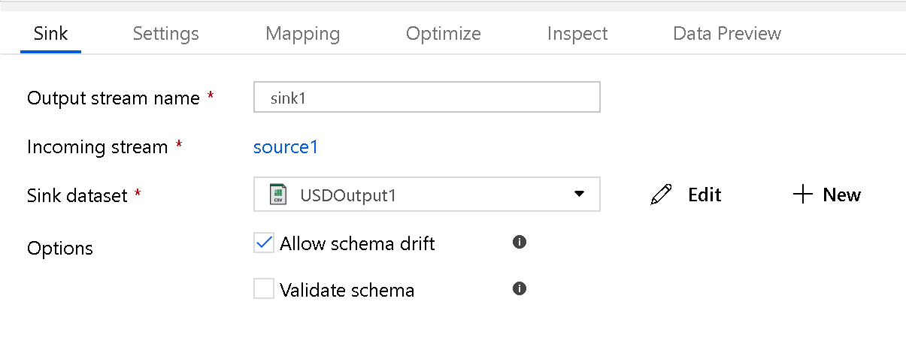

# Azure Data Factory Data Flow Transformations

## Sink Transformation

At the completion of your data flow transformation, you can sink your transformed data into a destination dataset. In the Sink transformation, you can choose the dataset definition that you wish to use for the destination output data.

A common practice to account for changing incoming data and to account for schema drift is to sink the output data to a folder without a defined schema in the output dataset. You can additionally account for all column changes in your sources by selecting "Allow Schema Drift" at the Source and then auto-map all fields in the Sink.

You can choose to overwrite, append, or fail the data flow when sinking to a dataset.

You can also choose "automap" to simply sink all incoming fields. If you wish to choose the fields that you want to sink to the destination, or if you would like to change the names of the fields at the destination, choose "Off" for "automap" and then click on the Mapping tab to map output fields:

### Output to single File
For Azure Storage Blob or Data Lake sink types, you will output the transformed data into a folder. Spark will generate partitioned output data files based on the partitioning scheme being used in the Sink transform. You can set the partitioning scheme by clicking on the "Optimize" tab. If you would like ADF to merge your output into a single file, click on the "Single Partition" radio button.

### Data Lake Folders
When Sinking your data transformations to Azure Blob Store or ADLS, choose a data lake *folder* as your destination folder path, not a file. ADF Data Flow will generate the output files for you in that folder.

### Azure Blob Folders
When sinking your data to Azure Blob Store datasets, make sure to choose a blob *folder* inside of a container, i.e.: container/folder. Do not land your data directlying in a container, create an output folder inside your container.

**PLEASE NOTE: Not all Dataset properties in Blob and ADW are configured for use within Data Flow during the preview period. Currently, ADF supports both a straight-forward Copy Activity as well as data tranformation-based Data Flow capability, both of which utilize Datasets. All of the Dataset properties present today work with Copy Activity. The UI will try to notify you interactively of which properties are not recognized by Data Flow. We will updates these properties during each subsequent iteration of Data Flow**

### Azure SQL Data Warehouse and SQL Database Sink Datasets

If you prefer to sink your transformed data directly into Azure SQL DW or Azure SQL DB instead of the Lake approach of landing transformed data into Blob or ADLS first, you can use Sink Datasets for Data Flow that are Azure SQL DB or DW. This will allow you to land your transformed data directly into Azure SQL DW within Data Flow without the need of adding a Copy Activity in your pipeline.

Start by creating an ADW dataset, just as you would for any other ADF pipeline, with a Linked Service that includes your ADW credentials and choose the database that you wish to connect to. In the table name, either select an existing table or type in the name of the table that you would like Data Flow to auto-create for you. A new table will be generated in the target database using the incoming metadata schema.

**NOTE: At this time, we are not supporting SQL Server square brackets " [ ] ", so please use the "Edit" link on the table name field and remove the brackets**

Azure SQL DW Datasets require staging locations to be specified because ADF uses Polybase behind the scenes. You'll select the Storage account you wish to use for staging the data for the Polybase load into ADW. The path field is of the format: "containername/foldername".

#### Save Policy

Overwrite will truncate the table if it exists, then recreate it and load the data. Append will simply insert the new rows. If the table from the Dataset table name does not exist at all in the target ADW, Data Flow will create the table, then load the data.

#### Field Mapping

On the Mapping tab of your Sink transformation, you can map the incoming (left side) columns to the destination (right side). When you sink data flows to files, ADF will always write new files to a folder. When you map to a database dataset, you can choose to either generate a new table with this schema (set Save Policy to "overwrite") or insert new rows to an existing table and map the fields to the existing schema.

You can use multi-select in the mapping table to Link multiple columns with one click, Delink multiple columns or map multiple rows to the same column name.

If you'd like to reset your columns mappings, press the "Remap" button to reset the mappings.

#### Max Concurrent Connections

You can set the maximum concurrent connections in the Sink transformation when writing your data to an Azure database connection.

