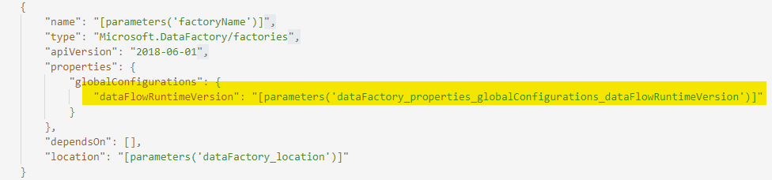
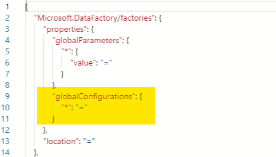

# ADF Data Flows Versioning

### This is a feature that will allow you to test your data factory data flows by executing your factory on a version that only updates on a monthly basis, as opposed to the live service which is updated weekly.

#### JSON ARM Template config

"properties": {
"globalConfigurations": {
dataFlowRuntimeVersion: "Candidate"
}
}

#### Valid values for Runtime Version are:
* Stable (this build is updated on the 15th of every month and is the previous Candidate build)
* Candidate (this build is updated on the 1st of every month and becomes "Stable" on the 15th of the next month)
* Live (this is the current live service version of ADF Data Flows)
* If you leave the property set to blank, the default value will be "Live"

#### Recommended use of Data Flow versioning

If you wish to switch to versioned Data Flows, we recommend that you use "Stable" for the live production version of your factories and "Candidate" for your dev/test environment. You can also optionally maintain an "experimental" factory that is using the "Live" version that is the version of ADF data flows that is used by all general ADF customers. This would give you an opportuntity to experiment with the features in ADF that are deployed on a weekly cadence.

#### Include data flow runtime version in ARM template

To include the runtime version in the ARM template, it is very similar to global parameters, which has a CI/CD section [here](https://docs.microsoft.com/azure/data-factory/author-global-parameters#cicd). Check the "Include in ARM template" checkbox when in git mode.

Once it is included in the ARM template it will be parametrizable like any other factory detail - it will look something like this:

The options are Live, Candidate, Stable. If it is not showing up in the ARM template as parametrizable, you may have a custom parameter definition file or added git to your factory before this change, in which case you should make sure the parametrization template includes a global configurations section like this:

