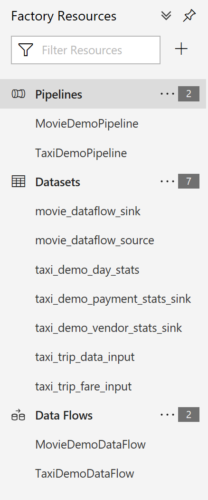

Get started with your first ADF Data Flow by first building a new Factory in the SE Asia region using the ARM Template in the Samples folder.

You can use PowerShell or the Azure Portal Template Deploymnet mechanism to build the factory from the ARM Template.

When filling-out the parameter fields for the ARM Template, you are only required to complete the Resource Group, FActory Name and Databricks fields. You can enter placeholder dummy values for Azure Databricks connectivity and correct those values later after you begin building your Data Flow.

The folder paths for the sample data can also be corrected later. For now, generate a Factory with these values and begin building your Data Flow.

You will see a series of sample Pipeleines, Datasets, Linked Services and Data Flows to get you started:

